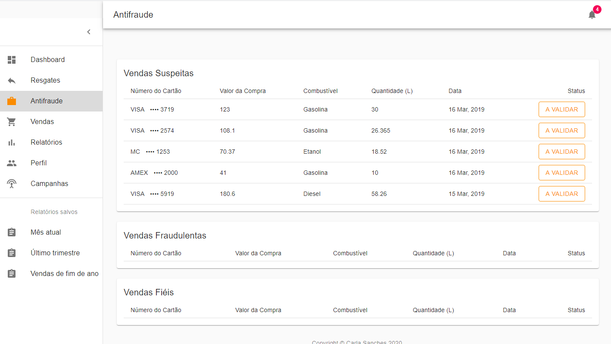

# Desafio Front-end ClubPetro: Sistema Antifraude

Esse projeto foi iniciado com  [Create React App](https://github.com/facebook/create-react-app).

Para rodar a aplicação, acesse o diretório e digite:

### `npm start`

Roda o app no modo de desenvolvimento. 
Abra [http://localhost:3000](http://localhost:3000) para ver no Browser.

### Funcionamento esperado da aplicação

Após iniciar a aplicação a seguinte tela será exibida:

Ao clicar no botão do status de uma venda, é possível classificá-la:

Em seguida o sistema pede uma confirmação de acordo com a classificação:

As vendas classificadas são inseridas em suas respectivas tabelas:

É possível desfazer uma classificação clicando no botão de status:

A venda, então, volta a ser suspeita:

### Versões de recursos utilizados

* ReactJS 16.12.0
* Node JS 13.6.0
* npm 6.13.4
* Dashboard Template Material-UI